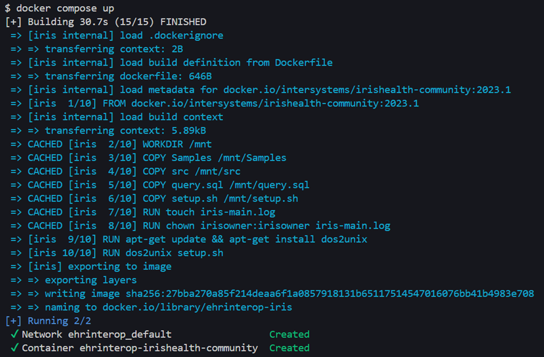
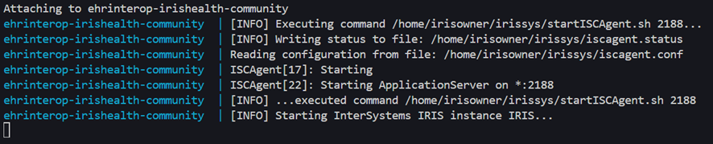
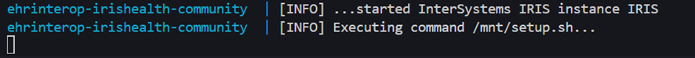
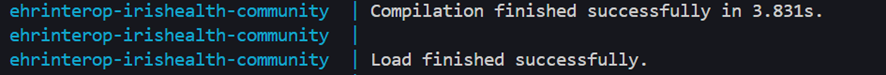
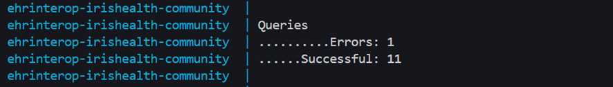
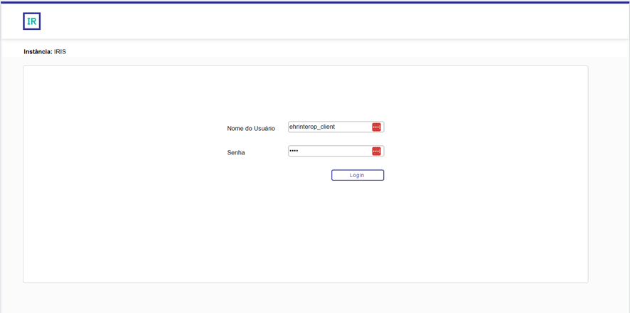

# EHR Interop - Induction Kit

---
## Prerequisites
- Docker
- Git

In case it have not been done yet, clone the current repository using `git`
```
git clone https://github.com/enricotm-inter/EHRInterop.git
```

---
## Running the `Docker` container
To start the IRIS instance, simply run `docker compose up` in the terminal
> *After running **docker compose up**, there is no need for any further configuration. This section will walkthrough some of the steps for the initialization, but it may be skipped to [Opening the Management Portal](#opening-the-management-portal)*



After building the docker image, the IRIS instance should be starting



When the instance finishes to start, it will initiate its setup



If everything worked correctly, the terminal should show that the setup was executed


Also, it is possible to check in the logs if all the classes compiled succesfully and if the queries were executed




> *It is expected to receive **1** query error, due to the `DROP FOREIGN SERVER ...` statement*

---
## Opening the Management Portal

First, make sure the instance finished starting and setting up before continuing


If the IRIS instance finished starting up, it is possible to access the instance **Management Portal** with the url *http://localhost:52775/csp/healthshare/ehrinterop/EnsPortal.ProductionConfig.zen* that will open directly into the **Production**

When prompted, use username `ehrinterop_client` and password `1010` to login




### If everything worked, the IRIS instance should open the Production and should be ready for testing the EHR Interop Induction Kit!
